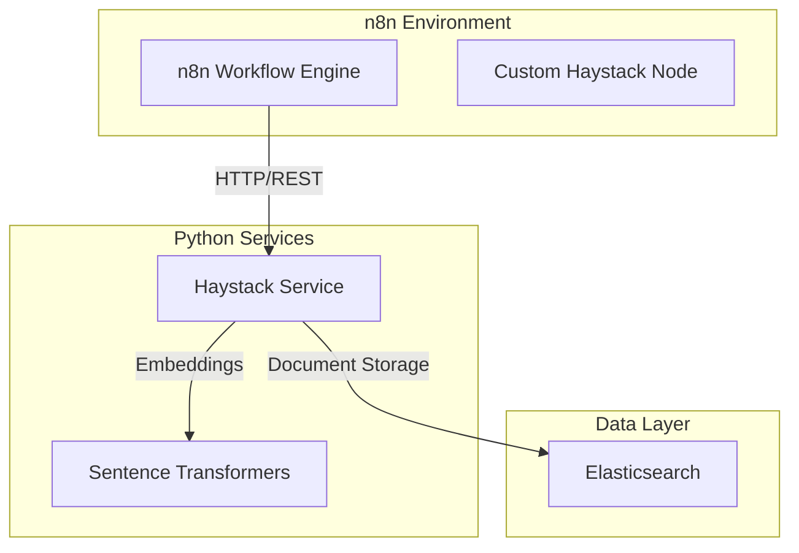

# n8n-nodes-haystack

[](https://opensource.org/licenses/MIT)
[](https://n8n.io)
[](https://www.docker.com/)
[](https://www.python.org/)
[](https://www.typescriptlang.org/)

A powerful n8n community node that integrates Haystack and Elasticsearch to enable advanced document search, hierarchical document management, and AI-powered legal document analysis workflows.

## 🎯 Overview

This project provides a custom n8n node that bridges the gap between n8n's workflow automation capabilities and advanced document processing. It's specifically optimized for legal document analysis but can be adapted for any document-heavy workflow.

### Key Features

- 📚 **Document Hierarchy Management** - Store and navigate complex parent-child document relationships
- 🔍 **Hybrid Search** - Combine keyword (BM25) and semantic (vector) search for optimal results
- 🏛️ **Legal Document Optimization** - Specialized handling for legal precedents, case law, and regulatory documents
- 🚀 **Batch Processing** - Efficiently handle large document collections
- 🔗 **Full Provenance Tracking** - Maintain complete audit trails from summaries to source documents
- 🛠️ **REST API** - FastAPI-powered service with comprehensive documentation
- 🐳 **Docker-based** - Easy deployment with Docker Compose

## 📋 Table of Contents

- [Architecture](#-architecture)
- [Prerequisites](#-prerequisites)
- [Quick Start](#-quick-start)
- [Installation](#-installation)
- [Configuration](#-configuration)
- [Usage](#-usage)
- [API Reference](#-api-reference)
- [Development](#-development)
- [Testing](#-testing)
- [Troubleshooting](#-troubleshooting)
- [Contributing](#-contributing)
- [License](#-license)
- [Acknowledgments](#-acknowledgments)

## 🏗️ Architecture

The system consists of three main components working together:



### Components

1. **n8n Custom Node** (TypeScript)
   - Provides intuitive UI for document operations
   - Handles data transformation between n8n and Haystack
   - Supports all major operations: ingest, search, hierarchy management

2. **Haystack Service** (Python/FastAPI)
   - RESTful API for document processing
   - Manages embeddings using BAAI/bge-small-en-v1.5
   - Handles document hierarchy and relationships
   - Provides hybrid search capabilities

3. **Elasticsearch** (Document Store)
   - Stores documents with 384-dimensional embeddings
   - Supports both keyword and vector search
   - Maintains document relationships and metadata

## 📦 Prerequisites

- **Docker** & **Docker Compose** (required)
- **Node.js** 18+ and npm (for development only)
- **Python** 3.10+ (for local development only)
- **Git** (for cloning the repository)
- **4GB+ RAM** available for Docker
- **Ports available**: 8000 (Haystack API), 9200 (Elasticsearch)

## 🚀 Quick Start

1. **Clone the repository**
   ```bash
   git clone https://github.com/judicial-access/n8n-nodes-haystack.git
   cd n8n-nodes-haystack
   ```

2. **Build the n8n node**
   ```bash
   cd custom-nodes/n8n-nodes-haystack
   npm install
   npm run build
   cd ../..
   ```

3. **Start all services**
   ```bash
   ./start_haystack_quick.sh
   ```

4. **Access the services**
   - n8n UI: http://localhost:8080/n8n/
   - Haystack API: http://localhost:8000
   - API Documentation: http://localhost:8000/docs

5. **Test the integration**
   ```bash
   cd haystack-service
   python3 test_integration.py
   ```

## 💻 Installation

### Detailed Installation Steps

#### 1. Environment Setup

Ensure Docker and Docker Compose are installed:
```bash
docker --version  # Should be 20.10+
docker-compose --version  # Should be 2.0+
```

#### 2. Clone and Navigate

```bash
git clone https://github.com/judicial-access/n8n-nodes-haystack.git
cd n8n-nodes-haystack/n8n
```

#### 3. Build the Custom Node

```bash
cd custom-nodes/n8n-nodes-haystack
npm install
npm run build
```

This compiles the TypeScript code and prepares the node for n8n.

#### 4. Configure Environment

The default configuration works out of the box. For production, you may want to adjust:

- Elasticsearch memory settings in `docker-compose.haystack.yml`
- API authentication (currently disabled for development)
- Network configuration for your environment

#### 5. Start Services

```bash
cd ../..  # Return to n8n directory
./start_haystack_quick.sh
```

This script:
- Starts Elasticsearch and waits for it to be healthy
- Builds and starts the Haystack service
- Creates the necessary Elasticsearch index
- Verifies all services are running

#### 6. Verify Installation

Check service health:
```bash
curl http://localhost:8000/health
curl http://localhost:9200/_cluster/health
```

## ⚙️ Configuration

### Elasticsearch Configuration

The Elasticsearch index is configured with:
- **Shards**: 1 (adjustable for larger deployments)
- **Replicas**: 0 (increase for production)
- **Vector dimensions**: 384 (matches BGE-small model)
- **Similarity**: Cosine
- **HNSW parameters**: m=16, ef_construction=200

### Haystack Service Configuration

Environment variables (in `docker-compose.haystack.yml`):
```yaml
environment:
  - ELASTICSEARCH_HOST=http://elasticsearch:9200
  - ELASTICSEARCH_INDEX=judicial-documents
  - HAYSTACK_MODEL=BAAI/bge-small-en-v1.5
```

### n8n Node Configuration

The node connects to the Haystack service at `http://haystack-service:8000` by default. This can be changed in the node's connection settings.

## 📖 Usage

### In n8n Workflows

1. **Add the Haystack Search node** to your workflow
2. **Configure the operation**:
   - Ingest Documents
   - Search
   - Get Hierarchy
   - Health Check

#### Example: Document Ingestion

```json
{
  "documents": [
    {
      "content": "Supreme Court ruling on constitutional rights...",
      "metadata": {
        "source": "case_123.pdf",
        "date": "2024-01-15",
        "court": "Supreme Court"
      },
      "document_type": "ruling",
      "hierarchy_level": 0
    }
  ]
}
```

#### Example: Hybrid Search

```json
{
  "query": "constitutional rights due process",
  "top_k": 10,
  "use_hybrid": true,
  "filters": {
    "document_type": "ruling"
  }
}
```

### Via REST API

The Haystack service exposes a REST API at http://localhost:8000.

#### Ingest Documents

```bash
curl -X POST "http://localhost:8000/ingest" \
     -H "Content-Type: application/json" \
     -d '{
       "documents": [{
         "content": "Legal document content here",
         "metadata": {"source": "test.pdf"},
         "document_type": "source_document",
         "hierarchy_level": 0
       }]
     }'
```

#### Search Documents

```bash
curl -X POST "http://localhost:8000/search" \
     -H "Content-Type: application/json" \
     -d '{
       "query": "legal precedent",
       "top_k": 5,
       "use_hybrid": true
     }'
```

## 📚 API Reference

### Endpoints

#### `GET /health`
Health check endpoint that returns service status and connection information.

**Response:**
```json
{
  "status": "healthy",
  "elasticsearch_connected": true,
  "documents_indexed": 42,
  "embedding_model_loaded": true
}
```

#### `POST /ingest`
Ingest documents with optional hierarchy metadata.

**Request Body:**
```json
{
  "documents": [
    {
      "content": "string",
      "metadata": {},
      "document_type": "string",
      "document_id": "string (optional)",
      "parent_id": "string (optional)",
      "hierarchy_level": 0
    }
  ]
}
```

#### `POST /search`
Search documents using hybrid, vector, or BM25 search.

**Request Body:**
```json
{
  "query": "string",
  "top_k": 10,
  "use_hybrid": true,
  "use_vector": false,
  "use_bm25": false,
  "include_hierarchy": false,
  "filters": {}
}
```

#### `POST /hierarchy`
Retrieve document hierarchy and relationships.

**Request Body:**
```json
{
  "document_id": "string",
  "include_parents": true,
  "include_children": true,
  "max_depth": 3
}
```

### Full API Documentation

Interactive API documentation is available at http://localhost:8000/docs when the service is running.

## 🛠️ Development

### Project Structure

```
n8n/
├── custom-nodes/n8n-nodes-haystack/  # n8n custom node
│   ├── nodes/                        # Node implementations
│   ├── credentials/                  # Authentication schemas
│   └── dist/                         # Compiled output
├── haystack-service/                 # Python FastAPI service
│   ├── haystack_service_simple.py    # Main service
│   ├── elasticsearch_setup.py        # Index configuration
│   └── test_integration.py           # Integration tests
└── docker-compose.haystack.yml       # Service orchestration
```

### Development Workflow

1. **Node Development** (TypeScript)
   ```bash
   cd custom-nodes/n8n-nodes-haystack
   npm run dev  # Watch mode
   ```

2. **Service Development** (Python)
   ```bash
   cd haystack-service
   # Edit haystack_service_simple.py
   # Changes auto-reload in Docker
   ```

3. **View Logs**
   ```bash
   docker-compose -f ../docker-compose.yml -f docker-compose.haystack.yml logs -f haystack-service
   ```

### Code Style

- **TypeScript**: ESLint + Prettier (run `npm run lint`)
- **Python**: Follow PEP 8 guidelines
- **Commits**: Use conventional commits format

## 🧪 Testing

### Integration Tests

Run the provided integration test suite:

```bash
cd haystack-service
python3 test_integration.py
```

This tests:
- Document ingestion
- Search functionality (BM25, vector, hybrid)
- Hierarchy retrieval
- Service health checks

### Manual Testing

1. **Test in n8n**:
   - Create a new workflow
   - Add the Haystack Search node
   - Test each operation

2. **Test via API**:
   - Use the Swagger UI at http://localhost:8000/docs
   - Or use curl/Postman for manual API testing

## 🔧 Troubleshooting

### Common Issues

#### Node doesn't appear in n8n

```bash
# Restart n8n to reload custom nodes
docker restart data_compose-n8n-1
```

#### Services won't start

```bash
# Check if ports are in use
lsof -i :8000
lsof -i :9200

# Clean up and restart
./cleanup_haystack_only.sh
./start_haystack_quick.sh
```

#### Elasticsearch connection errors

```bash
# Check Elasticsearch health
curl http://localhost:9200/_cluster/health

# View Elasticsearch logs
docker logs elasticsearch-judicial
```

#### Build failures

```bash
# For npm issues
cd custom-nodes/n8n-nodes-haystack
rm -rf node_modules package-lock.json
npm install

# For Docker issues
docker system prune -f
docker-compose build --no-cache
```

### Debugging

Enable debug logging:

```bash
# View all service logs
docker-compose -f ../docker-compose.yml -f docker-compose.haystack.yml logs -f

# View specific service
docker logs -f haystack-judicial
```

## 🤝 Contributing

We welcome contributions! Please follow these guidelines:

### Development Process

1. **Fork the repository**
2. **Create a feature branch**
   ```bash
   git checkout -b feature/your-feature-name
   ```
3. **Make your changes**
   - Write clean, documented code
   - Add tests if applicable
   - Update documentation
4. **Test thoroughly**
   ```bash
   npm run lint
   npm run build
   python3 test_integration.py
   ```
5. **Submit a Pull Request**

### Contribution Guidelines

- **Code Style**: Follow existing patterns and style guides
- **Documentation**: Update README and inline docs
- **Testing**: Add tests for new features
- **Commits**: Use clear, descriptive commit messages
- **Pull Requests**: Provide a clear description of changes

### Reporting Issues

When reporting issues, please include:
- Description of the problem
- Steps to reproduce
- Expected behavior
- Actual behavior
- Environment details (OS, Docker version, etc.)
- Relevant logs

## 📄 License

This project is licensed under the MIT License - see the [LICENSE](LICENSE) file for details.

```
MIT License

Copyright (c) 2024 Judicial Access Team

Permission is hereby granted, free of charge, to any person obtaining a copy
of this software and associated documentation files (the "Software"), to deal
in the Software without restriction, including without limitation the rights
to use, copy, modify, merge, publish, distribute, sublicense, and/or sell
copies of the Software, and to permit persons to whom the Software is
furnished to do so, subject to the following conditions:

The above copyright notice and this permission notice shall be included in all
copies or substantial portions of the Software.

THE SOFTWARE IS PROVIDED "AS IS", WITHOUT WARRANTY OF ANY KIND, EXPRESS OR
IMPLIED, INCLUDING BUT NOT LIMITED TO THE WARRANTIES OF MERCHANTABILITY,
FITNESS FOR A PARTICULAR PURPOSE AND NONINFRINGEMENT. IN NO EVENT SHALL THE
AUTHORS OR COPYRIGHT HOLDERS BE LIABLE FOR ANY CLAIM, DAMAGES OR OTHER
LIABILITY, WHETHER IN AN ACTION OF CONTRACT, TORT OR OTHERWISE, ARISING FROM,
OUT OF OR IN CONNECTION WITH THE SOFTWARE OR THE USE OR OTHER DEALINGS IN THE
SOFTWARE.
```

## 🙏 Acknowledgments

- [n8n.io](https://n8n.io) - Workflow automation platform
- [Haystack](https://haystack.deepset.ai/) - NLP framework (simplified implementation)
- [Elasticsearch](https://www.elastic.co/) - Search and analytics engine
- [Sentence Transformers](https://www.sbert.net/) - State-of-the-art embeddings
- [FastAPI](https://fastapi.tiangolo.com/) - Modern web framework for Python

### Special Thanks

- The n8n community for inspiration and support
- Legal tech professionals who provided use case insights
- Open source contributors who make projects like this possible

---

<p align="center">
  Made with ❤️ for the legal tech community
</p>

<p align="center">
  <a href="https://github.com/judicial-access/n8n-nodes-haystack/issues">Report Bug</a>
  ·
  <a href="https://github.com/judicial-access/n8n-nodes-haystack/issues">Request Feature</a>
  ·
  <a href="https://github.com/judicial-access/n8n-nodes-haystack/discussions">Discussions</a>
</p>